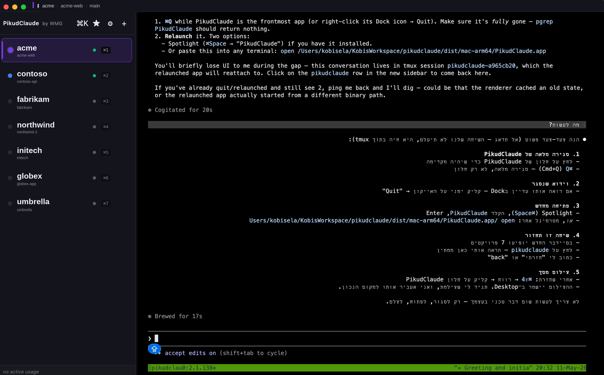

# pikud.io — landing page

Single-page static site for PikudClaude. No build step, no JS framework.

## Files

- `index.html` — markup
- `styles.css` — all styles
- `assets/` — icon SVG + PNGs (copied from `../build/`)
- `CNAME` — custom domain for GitHub Pages

## Local preview

```sh
cd site && python3 -m http.server 8080
# open http://localhost:8080
```

## Deploy — GitHub Pages from `/site`

1. Push to a branch with this `/site` folder.
2. Repo Settings → Pages → Source: "Deploy from a branch" → branch `main`, folder `/site`.
3. Pages will pick up `CNAME` and serve at `pikud.io` once DNS points to GH Pages.

### DNS

At your registrar for `pikud.io`:

- `A` records for the apex pointing to GitHub Pages IPs:
  - `185.199.108.153`
  - `185.199.109.153`
  - `185.199.110.153`
  - `185.199.111.153`
- `AAAA` records (optional, IPv6):
  - `2606:50c0:8000::153`
  - `2606:50c0:8001::153`
  - `2606:50c0:8002::153`
  - `2606:50c0:8003::153`
- `CNAME` for `www`: `wmgltd.github.io` (or your GH org's pages host)

GitHub Pages will issue Let's Encrypt TLS automatically once DNS resolves.

## Swapping in real screenshots

`index.html` has one placeholder block (`.placeholder-shot`) inside the hero. Replace with:

```html

```

Recommended capture: full app window at 1600×1000 (16:10), PNG, ~250 KB after `pngquant`.
